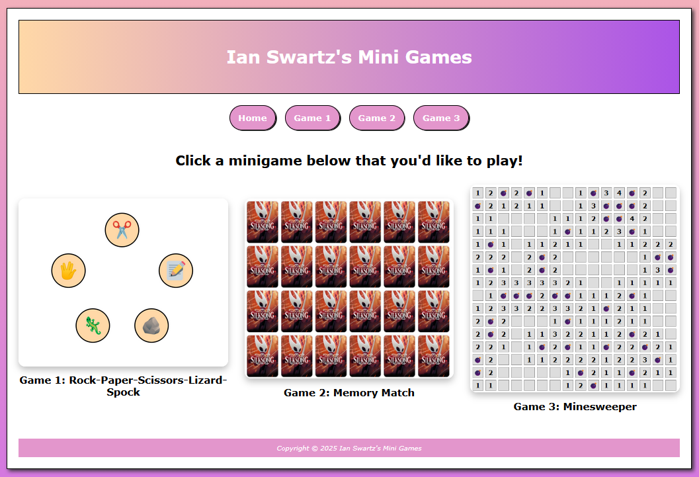
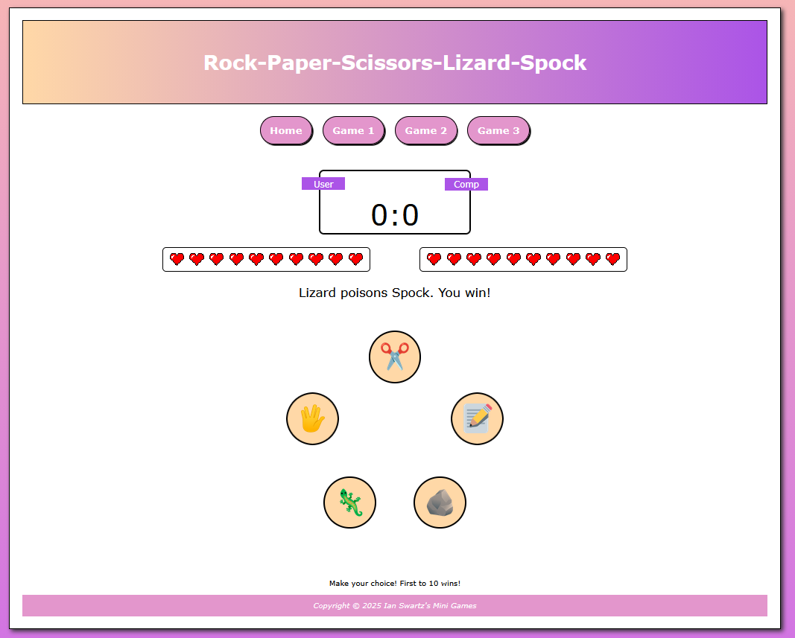
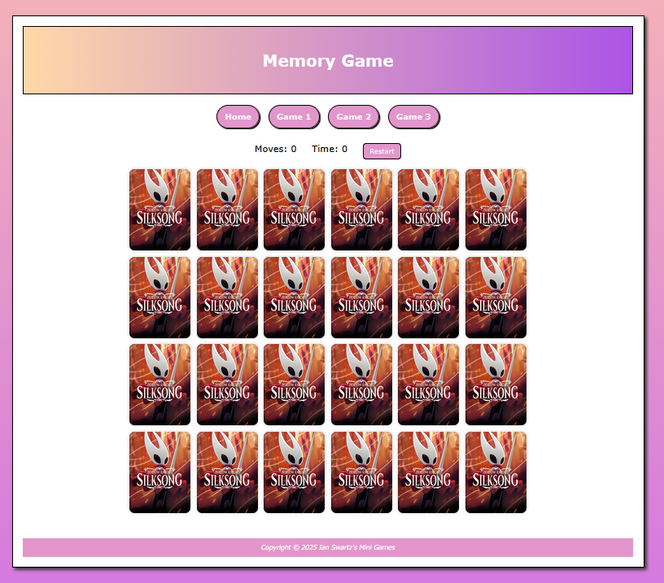
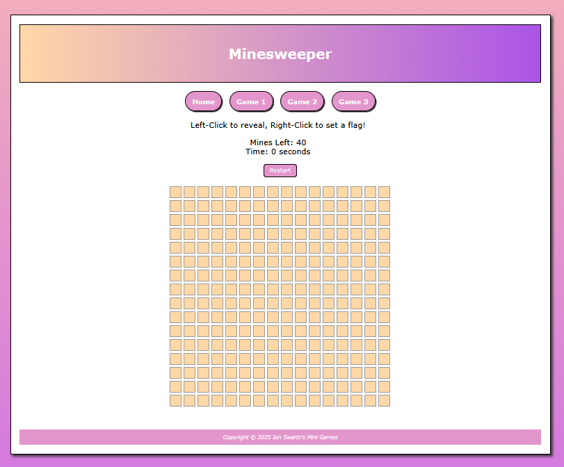

# Ian Swartz's Mini Games
A browser-based collection of interactive games built with **HTML, CSS, and JavaScript**.  
This project was created to strengthen front-end development skills through game logic, DOM manipulation, UI design, and browser-side state management.

## Live Demo

Play the project here:  
**https://ian-swartz.github.io/Ian-Swartzs-Mini-Games/**

---

## Screenshots

### Home Page


### Rock Paper Scissors Lizard Spock


### Memory Game


### Nine Men’s Morris


---

## Project Overview

Ian Swartz's Mini Games is a front-end portfolio project that combines multiple browser-playable experiences into one cohesive site. The project focuses on:

- Interactive JavaScript-based gameplay
- Responsive page structure and styling
- Dynamic DOM updates
- Reusable front-end organization
- Persistent browser storage for player statistics
- Polished UI enhancements for a stronger portfolio presentation

This repository is intended to demonstrate both technical fundamentals and project presentation quality for internships and entry-level software roles.

---

## Games Included

### 1. Rock Paper Scissors Lizard Spock
An expanded version of Rock Paper Scissors with five move options and round-based scoring.

**Highlights**
- Computer opponent with randomized choice generation
- Live score updates
- Persistent lifetime match statistics with `localStorage`
- Lifetime statistics reset control
- Shared project layout and navigation

### 2. Memory Game
A classic card-matching game where the player flips cards to find matching pairs.

**Highlights**
- Dynamically generated game board
- Move counter
- Live timer
- Restart game button
- animated card flip transitions
- in-page win modal with new game flow
- dynamic reset/new game button behavior

### 3. Minesweeper
A browser implementation of the classic logic puzzle video game.

**Highlights**
- Dynamic CSS Grid generation suuporting full 16x16 game board
- Guaranteed first-click safety ensuring the first clicked cell and its neighbors never contain mines
- Recursive cascade reveal mechanism that automatically uncovers adjacent empty cells
- Live game metrics including a running match timer and a dynamic flagged mine counter
- Dual-input controls with standard **left-click** to *reveal* and **right-click** to *place*/*remove* flags
- Instant win/loss state assessment that reveals all remaining mine locations upon game over
- Seamless board reset and timer initialization via the integrated restart system

---

## Tech Stack

- **HTML5**
- **CSS3**
- **Vanilla JavaScript**

---

## What This Project Demonstrates

This project was built to showcase practical front-end skills, including:

- DOM manipulation
- Event-driven JavaScript
- Game-state management
- Browser storage with `localStorage`
- Responsive layout structure
- Reusable page layout design
- UI polish through hover effects, animations, and modal interactions
- Maintainable project organization
- User-focused front-end improvements

---

## Project Structure
```
├── images
│   ├── screenshots
│   │   ├── home-page.png
│   │   ├── memory-match.png
│   │   ├── minesweeper.png
│   │   └── rpsls.png
│   ├── back.jpg
│   ├── heart.png
│   ├── home-game1.png
│   ├── home-game2.png
│   ├── home-game3.png
│   ├── img1.jpg
│   ├── img10.jpg
│   ├── img11.jpg
│   ├── img12.jpg
│   ├── img2.jpg
│   ├── img3.jpg
│   ├── img4.jpg
│   ├── img5.jpg
│   ├── img6.jpg
│   ├── img7.jpg
│   ├── img8.jpg
│   ├── img9.jpg
│   ├── lizard.png
│   ├── paper.png
│   ├── rock.png
│   ├── scissors.png
│   └── spock.png
├── game1.html
├── game1.js
├── game2.html
├── game2.js
├── game3.html
├── game3.js
├── index.html
├── README.md
└── styles.css
```

---

## Author

Developed by: Ian Swartz 

GitHub: https://github.com/ian-swartz

---
Project Created for Millersville CMSC 421 - Web Application Development

Original CodeSandbox Share Link: **https://codesandbox.io/p/sandbox/project-2-front-end-basics-ian-swartz-f63kxm**

CodeSanbox Website Link: **https://f63kxm.csb.app/**

(CodeSandbox doesn't always load all the images, which I believe may be a server issue).

